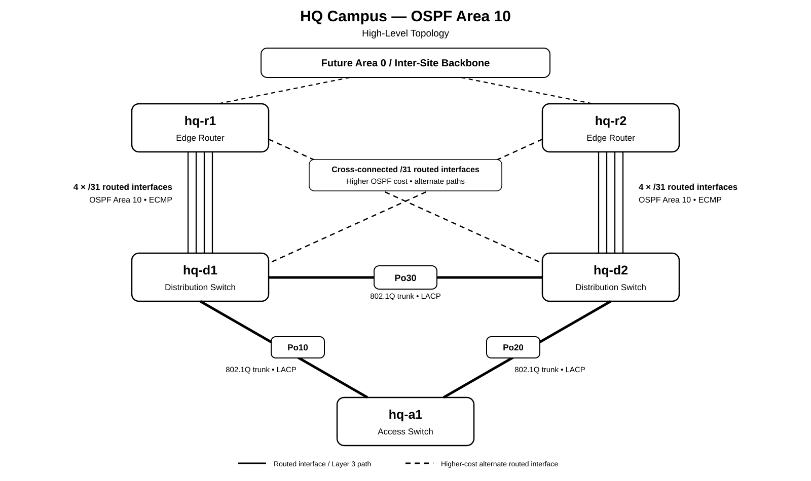

# Multi-Site CML Home Lab

A practical Cisco Modeling Labs project focused on enterprise networking, resilience, troubleshooting, and network automation.

The lab is developed as an evolving technical portfolio, with each stage designed, implemented, verified, failure-tested, and documented — rather than treated as an isolated configuration exercise.



## Project Goals

- Build a realistic multi-site Cisco network using enterprise routing and switching concepts.
- Apply structured IPv4 addressing, VLSM, `/31` point-to-point networks, and `/32` loopbacks.
- Design and test Layer 2 and Layer 3 redundancy.
- Develop practical troubleshooting and failure-testing skills.
- Gain hands-on experience with Linux, Git, Python, Ansible, and Cisco APIs.
- Introduce monitoring, logging, and network automation as the project develops.
- Maintain clear design rationale, implementation evidence, and verification results for use as a technical portfolio.

## Current Architecture

The first site is the **HQ Campus**, designed as a five-device, two-tier collapsed-core topology:

- 2 × Edge Routers
- 2 × Distribution Switches
- 1 × Access Switch

HQ operates internally as **OSPF Area 10** and is designed to connect later to an **Area 0 inter-site backbone**.

A second **Branch Campus**, planned as **OSPF Area 20**, will be introduced in a later phase and connected through the Area 0 backbone as the multi-site design develops.

Current HQ design features include:

- VLAN segmentation with VLSM addressing
- HSRP first-hop gateway redundancy
- Rapid PVST+ with HSRP/STP role alignment
- Layer 2 LACP EtherChannel
- Independent routed `/31` Distribution-to-Edge interfaces
- Four-path OSPF ECMP
- Higher-cost cross-connected OSPF paths
- `/32` loopbacks for stable routing identities
- Dedicated native, parking, and management VLANs

The full HQ design is documented in:

[`docs/hq-campus-design.md`](docs/hq-campus-design.md)

## Current Status

The **HQ design baseline is complete**.

The current phase is implementation and verification in Cisco Modeling Labs.

Design intent is kept separate from implementation evidence. Features are only treated as **as-built** after they have been configured, verified, and tested.

Planned HQ verification includes:

- EtherChannel formation and member-link failure
- 802.1Q trunk state, native VLAN consistency, and allowed-VLAN forwarding
- HSRP failover and preemption
- Rapid PVST+ root and forwarding behaviour
- OSPF neighbour formation
- Four-path ECMP route installation
- Route selection after deliberate OSPF cost changes
- Alternate-path reconvergence
- Device and interface failure testing

## Lab Environment

The project uses:

- Cisco Modeling Labs
- VMware Workstation
- Windows 11 hosts
- Raspberry Pi 5 for monitoring and future automation services
- Git and GitHub for version control and project documentation
- Physical home-network connectivity for later multi-host and multi-site integration

Environment details, including host specifications and lab setup, are documented in:

[`docs/environment.md`](docs/environment.md)

The wider lab is intended to span two CML hosts, allowing the project to grow beyond the five-device HQ topology.

## Repository Structure

```text
multi-site-cml-lab/
├── README.md
├── diagrams/
│   └── hq-campus-area10-topology.svg
└── docs/
    ├── environment.md
    └── hq-campus-design.md
```

As the project develops, the repository will also contain implementation notes, verification evidence, configurations, troubleshooting records, and automation code.

## Roadmap

Planned development includes:

1. HQ implementation and verification
2. Failure testing for HSRP, EtherChannel, STP, OSPF, and ECMP
3. Monitoring, SNMP, syslog, and metrics using the Raspberry Pi
4. Layer 2 security and ACL policy
5. Area 0 inter-site backbone
6. Branch Campus build (OSPF Area 20)
7. GRE inter-site connectivity
8. GRE over IPsec
9. Dual-tunnel and WAN resilience
10. Python and Ansible network automation

## Project Approach

The project follows an evidence-based workflow:

**Design → Implement → Verify → Break → Troubleshoot → Document → Automate**

The aim is not only to demonstrate that a configuration works, but to show why the design was chosen, how it behaves during failure, and how its operation can be verified.
