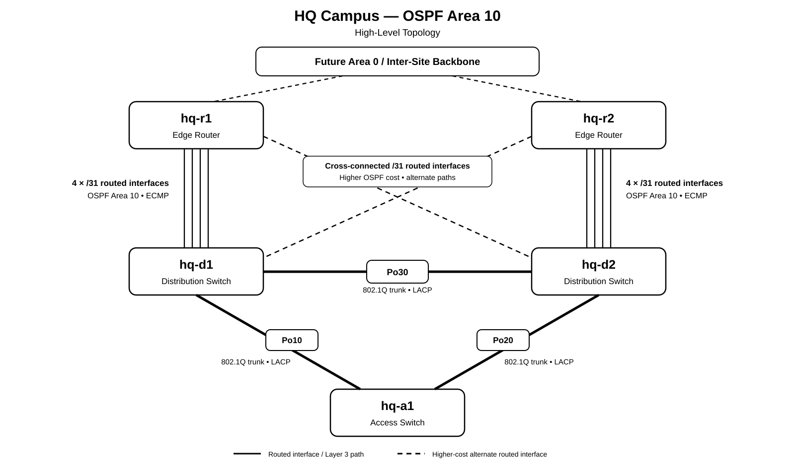

# Multi-Site CML Home Lab

A practical Cisco Modeling Labs project focused on enterprise networking, resilience, troubleshooting, and network automation.

The lab is developed as an evolving technical portfolio, with each stage designed, implemented, verified, failure-tested, and documented — rather than treated as an isolated configuration exercise.



## Project Goals

- Build a realistic multi-site Cisco network using enterprise routing and switching concepts.
- Apply structured IPv4 addressing, VLSM, `/31` point-to-point networks, and `/32` loopbacks.
- Design and test Layer 2 and Layer 3 redundancy.
- Develop practical troubleshooting and failure-testing skills.
- Gain hands-on experience with Linux, Git, Python, Ansible, and Cisco APIs.
- Introduce monitoring, logging, and network automation as the project develops.
- Maintain clear design rationale, implementation evidence, and verification results for use as a technical portfolio.

## Current Architecture

The first site is the **HQ Campus**, designed as a five-device, two-tier collapsed-core topology:

- 2 × Edge Routers
- 2 × Multilayer Distribution Switches
- 1 × Access Switch

HQ operates internally as **OSPF Area 10** and is designed to connect later to an **Area 0 inter-site backbone**.

A second **Branch Campus**, planned as **OSPF Area 20**, will be introduced in a later phase and connected through the Area 0 backbone as the multi-site design develops.

Current HQ design features include:

- VLAN segmentation with VLSM addressing
- HSRP first-hop gateway redundancy
- Rapid PVST+ with HSRP/STP role alignment
- Layer 2 LACP EtherChannel
- Independent routed `/31` Distribution-to-Edge interfaces
- Four-path OSPF ECMP
- Higher-cost cross-connected OSPF paths
- `/32` loopbacks for stable routing identities
- Dedicated native, parking, and management VLANs

The full HQ design is documented in:

[`docs/hq-campus-design.md`](docs/hq-campus-design.md)

## Current Status

The HQ campus build has progressed through the complete Layer 2 and first-hop redundancy stages.

Phases **01–05 are verified as-built**. The current development work combines **Phase 06 — Routed `/31`s and Loopbacks** with **Phase 07 — OSPF Area 10**, so the Layer 3 underlay and dynamic routing can be built and verified together.

| Phase | Scope | Status |
|---:|---|---|
| 01 | Platform baseline | **Verified** |
| 02 | Layer 2 / VLAN baseline | **Verified** |
| 03 | LACP EtherChannel | **Verified** |
| 04 | Rapid PVST+ | **Verified** |
| 05 | SVIs and HSRP | **Verified** |
| 06 | Routed `/31`s and loopbacks | **Current** |
| 07 | OSPF Area 10 | **Current** |
| 08 | ECMP | Planned |
| 09 | OSPF cost engineering | Planned |
| 10 | Failure testing | Planned |
| 11 | Final acceptance | Planned |

Completed verification now includes:

- VLAN database and access-port policy
- LACP EtherChannel formation and member-link recovery
- 802.1Q trunk state, native VLAN consistency, and allowed-VLAN policy
- Rapid PVST+ root placement and path-failure behaviour
- SVI addressing and management reachability
- HSRP Active/Standby ownership, gateway failover, and preferred-state restoration
- HSRP/STP role alignment across the distribution layer

Current verification focus:

- Routed `/31` Distribution-to-Edge links
- `/32` loopback identities
- OSPF router IDs and passive-interface policy
- OSPF Area 10 adjacency formation
- Route advertisement and initial Layer 3 reachability

Detailed implementation status and verification records are maintained in:

[`docs/implementation/hq/README.md`](docs/implementation/hq/README.md)

## Lab Environment

The project uses:

- Cisco Modeling Labs
- VMware Workstation
- Windows 11 hosts
- Raspberry Pi 5 for monitoring and future automation services
- Git and GitHub for version control and project documentation
- Physical home-network connectivity for later multi-host and multi-site integration

Environment details, including host specifications and lab setup, are documented in:

[`docs/environment.md`](docs/environment.md)

The wider lab is intended to span two CML hosts, allowing the project to grow beyond the five-device HQ topology.

## Repository Structure

```text
multi-site-cml-lab/
├── README.md
├── .gitignore
│
├── diagrams/
│   └── hq-campus-area10-topology.svg
│
├── docs/
│   ├── environment.md
│   ├── hq-campus-design.md
│   ├── network-plan.md
│   ├── topology.md
│   └── implementation/
│       └── hq/
│           ├── README.md
│           ├── build-log.md
│           ├── verification-plan.md
│           ├── troubleshooting.md
│           └── deviations.md
│
├── evidence/
│   └── hq/
│       ├── platform-baseline/
│       ├── layer2-vlan-baseline/
│       ├── etherchannel/
│       ├── spanning-tree/
│       └── hsrp/
│
└── lab/
    └── cml-lab-exports/
        ├── README.md
        └── hq/
            ├── hq-phase-01-platform-baseline-2026-09-20.yaml
            └── hq-phase-05-svi-hsrp-2026-09-29.yaml
```

Repository areas have distinct roles:

- `docs/` — design intent, environment information, implementation records, verification plans, troubleshooting, and accepted deviations.
- `evidence/` — retained CLI and test evidence supporting verification results.
- `diagrams/` — topology and architecture visuals.
- `lab/cml-lab-exports/` — sanitised milestone CML exports used for restoration and version tracking.

## Roadmap

The project will continue through the following major stages:

1. Complete the HQ Layer 3 underlay and OSPF Area 10.
2. Verify ECMP, OSPF cost engineering, and defined failure scenarios.
3. Complete HQ final acceptance and as-built validation.
4. Introduce monitoring, SNMP, syslog, metrics, and NTP using the Raspberry Pi.
5. Build the Branch Campus as OSPF Area 20.
6. Connect HQ and Branch through the Area 0 inter-site backbone.
7. Add GRE inter-site connectivity.
8. Evolve GRE to GRE over IPsec and later dual-tunnel resilience.
9. Add Layer 2 security and ACL policy.
10. Introduce Python, Ansible, APIs, and network automation against the completed lab.

## Project Approach

The project follows an evidence-based workflow:

**Design → Implement → Verify → Break → Troubleshoot → Document → Automate**

The aim is not only to demonstrate that a configuration works, but to show why the design was chosen, how it behaves during failure, and how its operation can be verified.
