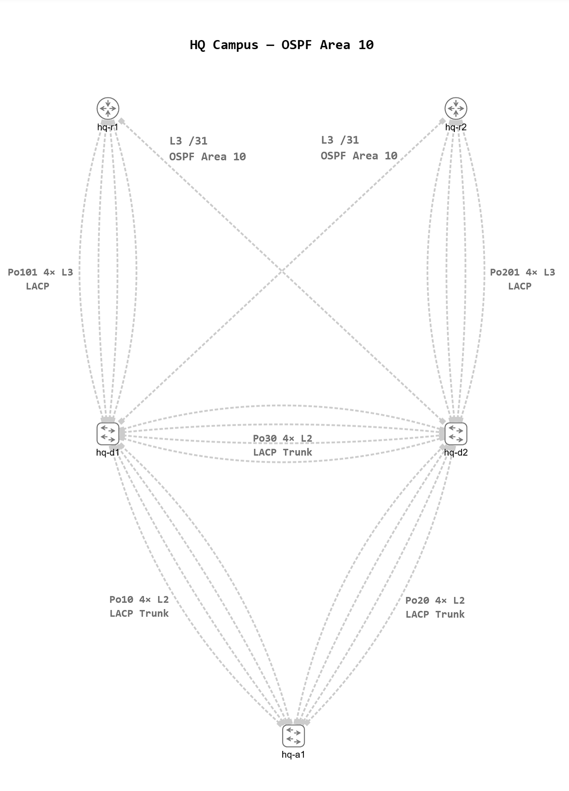

# HQ Campus Design

## Overview

The HQ campus uses a five-device, two-tier collapsed-core design consisting of a redundant distribution/core layer, a Layer 2 access layer, and dual WAN edge routers. The internal HQ routing domain operates as OSPF Area 10, with the edge routers providing redundant paths toward the Area 0 inter-site backbone and supporting future GRE/IPsec connectivity.

The topology is designed to provide resilient Layer 2 and Layer 3 connectivity using LACP EtherChannels, HSRP, Rapid PVST+, and OSPF. Redundant physical and logical paths are included so that link, gateway, routing, and device failures can be deliberately introduced, observed, verified, and documented.

The campus design also incorporates network segmentation and is designed to support additional security controls. Dedicated VLANs separate user, voice, server, IoT, guest, wireless, and management traffic, with a dedicated native VLAN for trunking and a separate parking VLAN for unused access ports. Additional controls such as port security, DHCP snooping, Dynamic ARP Inspection, and access-control policies will be introduced during later implementation phases.

Campus services and routed infrastructure use separate hierarchical address spaces. The addressing plan uses VLSM, /31 point-to-point networks, and /32 loopbacks to provide a structure that is readable, scalable, and suitable for route summarisation.

The HQ campus forms the first stage of a larger multi-site lab. Later phases will extend the design with monitoring, real services, secure inter-site connectivity, failure testing, and network automation.

## High-Level Topology

## VLAN and Gateway Design

| VLAN ID | VLAN Name | Function | IPv4 Prefix | HSRP Virtual IP | `hq-d1` SVI Address | `hq-d2` SVI Address |
|---:|---|---|---|---|---|---|
| 112 | `CORP-USERS` | Corporate user endpoints | `10.10.12.0/22` | `10.10.12.1` | `10.10.12.2` | `10.10.12.3` |
| 120 | `VOICE` | IP telephony endpoints | `10.10.20.0/23` | `10.10.20.1` | `10.10.20.2` | `10.10.20.3` |
| 130 | `SERVERS` | Server and application services | `10.10.30.0/25` | `10.10.30.1` | `10.10.30.2` | `10.10.30.3` |
| 140 | `IOT-CCTV` | IoT and surveillance devices | `10.10.40.0/23` | `10.10.40.1` | `10.10.40.2` | `10.10.40.3` |
| 152 | `GUEST` | Guest network access | `10.10.52.0/22` | `10.10.52.1` | `10.10.52.2` | `10.10.52.3` |
| 160 | `FACILITIES` | Printers and facilities devices | `10.10.60.0/26` | `10.10.60.1` | `10.10.60.2` | `10.10.60.3` |
| 170 | `BYOD-WLAN` | BYOD and wireless client access | `10.10.70.0/23` | `10.10.70.1` | `10.10.70.2` | `10.10.70.3` |
| 190 | `NATIVE` | Dedicated IEEE 802.1Q native VLAN | — | — | — | — |
| 191 | `PARKING` | Unused access ports | — | — | — | — |
| 199 | `NET-MGMT` | Network infrastructure management | `10.10.99.0/26` | `10.10.99.1` | `10.10.99.2` | `10.10.99.3` |

### Addressing and VLAN Conventions

For each routed VLAN, gateway addressing follows a consistent allocation:

- First usable address — HSRP Virtual IP and client default gateway
- Second usable address — `hq-d1` SVI address
- Third usable address — `hq-d2` SVI address

VLAN 190 is reserved as the dedicated non-default native VLAN for IEEE 802.1Q trunks and does not have an SVI.

VLAN 191 is reserved for unused access ports and does not have an SVI. Unused ports assigned to this VLAN are administratively shut down.

VLAN 1 is not used for production user traffic, management, or as the configured native VLAN in this design.

## Master Layer 3 Addressing Schedule

| Device | Interface | Role / Purpose | IPv4 Address / Prefix | HSRP Virtual IP | Peer / Routing Notes |
|---|---|---|---|---|---|
| `hq-d1` | `Vlan112` | Corporate user gateway SVI | `10.10.12.2/22` | `10.10.12.1` | HSRP with `hq-d2` |
| `hq-d2` | `Vlan112` | Corporate user gateway SVI | `10.10.12.3/22` | `10.10.12.1` | HSRP with `hq-d1` |
| `hq-d1` | `Vlan120` | Voice gateway SVI | `10.10.20.2/23` | `10.10.20.1` | HSRP with `hq-d2` |
| `hq-d2` | `Vlan120` | Voice gateway SVI | `10.10.20.3/23` | `10.10.20.1` | HSRP with `hq-d1` |
| `hq-d1` | `Vlan130` | Server gateway SVI | `10.10.30.2/25` | `10.10.30.1` | HSRP with `hq-d2` |
| `hq-d2` | `Vlan130` | Server gateway SVI | `10.10.30.3/25` | `10.10.30.1` | HSRP with `hq-d1` |
| `hq-d1` | `Vlan140` | IoT/CCTV gateway SVI | `10.10.40.2/23` | `10.10.40.1` | HSRP with `hq-d2` |
| `hq-d2` | `Vlan140` | IoT/CCTV gateway SVI | `10.10.40.3/23` | `10.10.40.1` | HSRP with `hq-d1` |
| `hq-d1` | `Vlan152` | Guest gateway SVI | `10.10.52.2/22` | `10.10.52.1` | HSRP with `hq-d2` |
| `hq-d2` | `Vlan152` | Guest gateway SVI | `10.10.52.3/22` | `10.10.52.1` | HSRP with `hq-d1` |
| `hq-d1` | `Vlan160` | Facilities gateway SVI | `10.10.60.2/26` | `10.10.60.1` | HSRP with `hq-d2` |
| `hq-d2` | `Vlan160` | Facilities gateway SVI | `10.10.60.3/26` | `10.10.60.1` | HSRP with `hq-d1` |
| `hq-d1` | `Vlan170` | BYOD/WLAN gateway SVI | `10.10.70.2/23` | `10.10.70.1` | HSRP with `hq-d2` |
| `hq-d2` | `Vlan170` | BYOD/WLAN gateway SVI | `10.10.70.3/23` | `10.10.70.1` | HSRP with `hq-d1` |
| `hq-d1` | `Vlan199` | Network management gateway SVI | `10.10.99.2/26` | `10.10.99.1` | HSRP with `hq-d2` |
| `hq-d2` | `Vlan199` | Network management gateway SVI | `10.10.99.3/26` | `10.10.99.1` | HSRP with `hq-d1` |
| `hq-d1` | `Po101` | Routed L3 Port-channel to `hq-r1` | `10.255.10.0/31` | — | `hq-r1` / OSPF Area 10 |
| `hq-r1` | `Po101` | Routed L3 Port-channel to `hq-d1` | `10.255.10.1/31` | — | `hq-d1` / OSPF Area 10 |
| `hq-d2` | `Po201` | Routed L3 Port-channel to `hq-r2` | `10.255.10.2/31` | — | `hq-r2` / OSPF Area 10 |
| `hq-r2` | `Po201` | Routed L3 Port-channel to `hq-d2` | `10.255.10.3/31` | — | `hq-d2` / OSPF Area 10 |
| `hq-d1` | `E3/0` | Routed cross-link to `hq-r2` | `10.255.10.4/31` | — | `hq-r2 E1/0` / OSPF Area 10 |
| `hq-r2` | `E1/0` | Routed cross-link to `hq-d1` | `10.255.10.5/31` | — | `hq-d1 E3/0` / OSPF Area 10 |
| `hq-d2` | `E3/0` | Routed cross-link to `hq-r1` | `10.255.10.6/31` | — | `hq-r1 E1/0` / OSPF Area 10 |
| `hq-r1` | `E1/0` | Routed cross-link to `hq-d2` | `10.255.10.7/31` | — | `hq-d2 E3/0` / OSPF Area 10 |
| `hq-r1` | `Loopback0` | Infrastructure identity / OSPF router ID | `10.255.10.129/32` | — | OSPF router ID `10.255.10.129` |
| `hq-r2` | `Loopback0` | Infrastructure identity / OSPF router ID | `10.255.10.130/32` | — | OSPF router ID `10.255.10.130` |
| `hq-d1` | `Loopback0` | Infrastructure identity / OSPF router ID | `10.255.10.131/32` | — | OSPF router ID `10.255.10.131` |
| `hq-d2` | `Loopback0` | Infrastructure identity / OSPF router ID | `10.255.10.132/32` | — | OSPF router ID `10.255.10.132` |

### Layer 3 Addressing Conventions

The master addressing schedule defines the IPv4 addresses assigned to all routed HQ interfaces.

For routed VLANs, the first usable address is reserved as the HSRP Virtual IP, the second usable address is assigned to `hq-d1`, and the third usable address is assigned to `hq-d2`.

Point-to-point routed infrastructure links use /31 prefixes. The lower address is assigned to the distribution switch and the higher address to the edge router.

Loopback0 provides a stable Layer 3 identity for each routing device and is explicitly used as the OSPF router ID.

Physical interfaces participating in Layer 3 EtherChannels are not individually addressed. The IPv4 address is assigned to the logical Port-channel interface.

VLANs 190 and 191 are intentionally absent from this schedule because they do not have Layer 3 SVIs.
